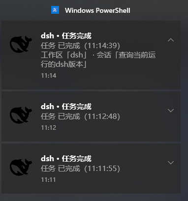

[中文](./README.md) | **English**

# dsh-notify


**The only dsh plugin with a system tray icon**: when the agent stops running (finished / aborted / error / waiting for your choice / session closed), a native Windows Toast pops up automatically with the body labeled "workspace · session", and a whale icon stays resident in the taskbar tray — switch away from the window during long tasks and one glance at the tray tells you whether it's done.

Zero runtime dependencies, zero build; one `dsh plugin add` command and it's ready to use.

## Screenshot



> Real Windows Toast capture: the body is labeled "workspace · session", and the whale icon stays
> resident in the taskbar tray.

## Features

- **Native Windows Toast notifications**: when the agent stops running (finished / aborted / error / output limit reached / waiting for your choice / session closed), a system notification pops up automatically with the body labeled "workspace · session" — tell at a glance which session finished;
- **Permanent system tray icon**: a whale icon stays resident in the taskbar tray; the right-click menu opens the dsh web page / quits the background process (competitors explicitly ship no tray — this plugin is the only one in the dsh ecosystem);
- **Anti-spam**: `rootsOnly` defaults to notifying only root sessions, so subagents won't flood you; `cooldownMs` sets the minimum interval between two notifications of the same type in the same session;
- **Zero runtime dependencies, zero build**: one `dsh plugin add` command and it's ready to use.

## Use cases

- **Switch windows during long tasks**: while a long LLM generation / batch job runs, switch to another app; when it ends, a tray notification pops up and one glance tells you the result;
- **Unattended batch jobs**: run multiple rounds overnight and get a Toast when everything is done — no need to keep watching the page;
- **Multiple sessions at once**: run several workspace sessions simultaneously; each notification body carries the "workspace · session" label, so nothing gets mixed up;
- **Watching subagents**: keep the default `rootsOnly: true` when you only care about root-session results, and turn it off when you need to watch subagents.

## Installation

```powershell
dsh plugin --profile web add dsh-notify
```

Install from GitHub: `dsh plugin --profile web add github:Pasumao/dsh-plugin-notify`

Install from source (local development / debugging):

```bash
git clone https://github.com/Pasumao/dsh-plugin-notify.git
cd dsh-plugin-notify
npm install
# Mount into the profile as a link: dependency (package name: dsh-notify)
```

After installing, restart `dsh web`; the plugin is active once the whale icon appears in the taskbar.

> Compatibility: Windows 10/11 · Node ≥ 22.5 · tested on DSH `0.1.1-rc.2`.

## Configuration

Override the config in the profile's `cordis.patch.yml` under the id `dsh-plugin-notify`. Common options:

| key | Default | Description |
|---|---|---|
| `cooldownMs` | `10000` | Minimum interval in milliseconds between two notifications of the same type in the same session |
| `rootsOnly` | `true` | Notify only root sessions; subagents won't flood you |
| `tray` | `true` | Enable/disable the tray icon |
| `titlePrefix` | `'dsh'` | Notification title prefix |

## Testing

```powershell
node scripts/test-harness.mjs   # Fires three real Toast notifications as a self-test
```

## FAQ

- **Not receiving notifications?** Check that Windows "Settings → System → Notifications" allows PowerShell to show notifications, and that you are not in Focus Assist / Do Not Disturb mode;
- **Only root-session notifications?** Keep the default `rootsOnly: true`; change it to `false` when you need to watch subagents;
- **Notifications too frequent?** Just increase `cooldownMs` (default 10000ms);
- **Tray icon missing?** Restart dsh web; if it is still gone, check whether the `tray: true` config key was overridden.

## Related plugins

This plugin is part of the **Pasumao dsh plugin ecosystem**; the published plugins in the series work well together:

| Plugin (npm) | GitHub | Description |
|---|---|---|
| [dsh-plugin-choice-refresh](https://www.npmjs.com/package/dsh-plugin-choice-refresh) | [GitHub repo](https://github.com/Pasumao/dsh-plugin-choice-refresh) | Choice enhancements: regenerate options / more options |
| [dsh-plugin-dev-kb](https://www.npmjs.com/package/dsh-plugin-dev-kb) | [GitHub repo](https://github.com/Pasumao/dsh-plugin-dev-kb) | Plugin development knowledge base (full mirror of official docs + skills) |
| [dsh-plugin-image-tools](https://www.npmjs.com/package/dsh-plugin-image-tools) | [GitHub repo](https://github.com/Pasumao/dsh-plugin-image-tools) | Image choice cards + inline images in replies + image pickup for blind models |
| [dsh-plugin-table-zoom](https://www.npmjs.com/package/dsh-plugin-table-zoom) | [GitHub repo](https://github.com/Pasumao/dsh-plugin-table-zoom) | Floating window for long chat tables + one-click Markdown copy |
| [dsh-plugin-windows-guard](https://www.npmjs.com/package/dsh-plugin-windows-guard) | [GitHub repo](https://github.com/Pasumao/dsh-plugin-windows-guard) | Windows environment guard: rule skills + mojibake detection / dangerous-write interception / encoding diagnosis & repair |
| [dsh-plugin-workbench](https://www.npmjs.com/package/dsh-plugin-workbench) | [GitHub repo](https://github.com/Pasumao/dsh-plugin-workbench) | VS Code-style file explorer + editable preview |

> For the other plugins in the series, see [Pasumao · dsh plugins](https://github.com/Pasumao); if you find them useful, a ⭐ on GitHub is appreciated.

## AI-generated disclosure

The code and documentation were generated with AI assistance (DeepSeek Harness), all human-reviewed and verified on a live machine (`scripts/test-harness.mjs` fires real Toast notifications as a self-test).

## License

[MIT](./LICENSE)
